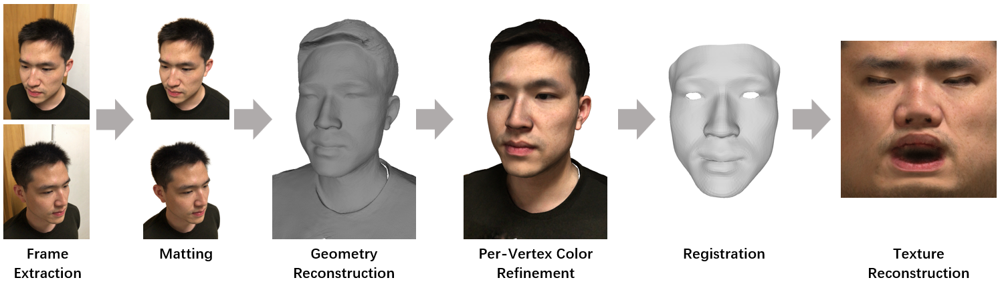

# STFR: Stable and Topologically-Consistent 3D Face Reconstruction from a Smartphone Video

An fully-automatic and efficient pipeline to reconstruct topologically-consistent 3D facial geometry (with texture) from a smartphone-captured video.

This code has been used in many of my research projects, including:
* [WildCap](https://yxuhan.github.io/WildCap/index.html): Facial Albedo Capture in the Wild via Hybrid Inverse Rendering (CVPR'2026)
* [DoRA](https://yxuhan.github.io/DoRA/index.html): Facial Appearance Capture at Home with Patch-Level Reflectance Prior (SIGGRAPH'2025)

## Introduction
Given a smartphone video captured around a human face, this code allows you to reconstruct the camera parameters for each frame, a detailed mesh, an topologically-consistent mesh (ICT topology), and the corresponding UV texture map.
To achieve this, the code is divided into the following steps:



**1. Video Frame Extraction**: Implemented using the `ffmpeg` library. One frame is saved every `video_step_size` frames, and the resolution (scaling ratio) of the saved frames can be specified via `video_ds_ratio`.

**2. Matting**: Foreground masks for each frame are obtained using [DAViD](https://github.com/microsoft/DAViD). These masks guide the geometry reconstruction module to focus only on the facial geometry and ignore the background.

**3. Geometry Reconstruction**: Camera parameters are estimated using [COLMAP](https://github.com/colmap/colmap), followed by geometry reconstruction with [2DGS](https://github.com/hbb1/2d-gaussian-splatting).

**4. Per-Vertex Color Refinement**: I implemented a custom method to refine the texture of the mesh exported by 2DGS. Specifically, a 3D Texture Volume is built using [tinycudann](https://github.com/NVlabs/tiny-cuda-nn/), which outputs the texture color for a given vertex coordinate of the mesh. With the geometry fixed, this volume is optimized to minimize the photometric loss (LPIPS loss + L1) between the rendered images and the 16 sharpest input views. This step is empirically necessary: the subsequent registration requires rendering the mesh from a frontal view and detecting landmarks on the rendered image, and blurry textures from 2DGS can cause the landmark detector to fail in some cases.

**5. Registration**: Fully automatic registration of the mesh reconstructed by 2DGS is performed using [Wrap](https://faceform.com/download-wrap/). No GUI operations are required; my program automatically invokes the command-line API provided by Wrap. Before registration, 3D landmarks must be obtained. My approach is to align the 2DGS-reconstructed mesh to a canonical space via FLAME fitting, render a frontal view image of the mesh in this canonical space, detect 2D landmarks on the rendered image, and project them to 3D. An alternative is to select a view from the captured images for 2D landmark detection and 3D projection, but this performs poorly in practice as a suitable view is not always available in the input frames. Furthermore, my landmark detector can locate 48 eye landmarks, which yields significantly better performance than the traditional 68-landmark detector (only 12 landmarks for the eyes).

**6. Texture Reconstruction**: I implemented an efficient and high-quality UV texture optimization method based on the [2D hash grid of Instant-NGP](https://arxiv.org/abs/2201.05989). I use the 2D hash grid to parameterize the UV texture, and then constrain the photometric loss (geometry-aware weighted L1 + LPIPS) between the re-rendered image and the captured image. 


## Run
First, configure the environment according to [ENV.md](ENV.md). Then, download the [example video](https://drive.google.com/file/d/1zwl7SW_aEsNBpEqpTHpCewi6RjE4NwOe/view?usp=sharing) into the `data` directory. The command to run the code is as follows:
```
CUDA_VISIBLE_DEVICES=0 python run.py \
    --video_path data/ljf.MOV \
    --video_step_size 10 \
    --video_ds_ratio 0.375 \
    --reg_close_eye 1 \
    --save_root workspace/ljf

The reg_close_eye parameter specifies whether the captured subject had their eyes closed. When reg_close_eye=1, the code uses a closed-eye template for registration; otherwise, an open-eye template is applied.
```

The above code takes approximately 21 minutes to execute on a single NVIDIA RTX 3090 GPU.

## Contact
If you have any questions or are interested in collaboration, please contact Yuxuan Han (hanyx22@mails.tsinghua.edu.cn).

## Citation
Please include the following citations if it helps your research:

    @inproceedings{han2025dora,
        author = {Han, Yuxuan and Lyu, Junfeng and Sheng, Kuan and Que, Minghao and Zhang, Qixuan and Xu, Lan and Xu, Feng},
        title = {Facial Appearance Capture at Home with Patch-Level Reflectance Prior},
        journal={SIGGRAPH},
        year={2025}
    }

    @inproceedings{han2026wildcap,
        author = {Han, Yuxuan and Ming, Xin and Li, Tianxiao and Shen, Zhuofan and Zhang, Qixuan and Xu, Lan and Xu, Feng},
        title = {WildCap: Facial Albedo Capture in the Wild via Hybrid Inverse Rendering},
        journal={CVPR},
        year={2026}
    }
